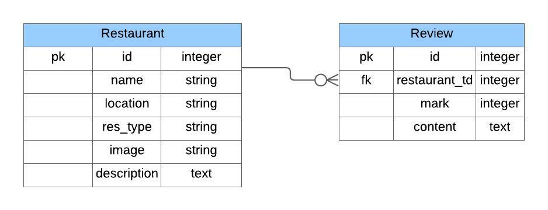

<center>

# Restaurant Reviewer Application

</center>

---

### Intro:

This application is part of my final step of the Flatiron Bootcamp voyage. In this application we can add, edit or delete restaurants, browse through ones already in it. For each restaurant we can add new, delete or edit old reviews which will afect restaurant rating as a guide for a better restaurant experience. Enjoy!

<center>


</center>

---

### Table of content

- [Restaurant Reviewer Application](#restaurant-reviewer-application)
    - [Intro:](#intro)
    - [Table of content](#table-of-content)
  - [Description](#description)
  - [Backend](#backend)
      - [Database](#database)
      - [Versioning](#versioning)
      - [File structure](#file-structure)
      - [Instalation](#instalation)
  - [Frontend](#frontend)
      - [Versioning of React and main dependencies](#versioning-of-react-and-main-dependencies)
      - [File structure](#file-structure-1)
      - [Instalation](#instalation-1)
  - [How To Use](#how-to-use)
  - [Future Uppgrades](#future-uppgrades)
  - [Bugs](#bugs)
  - [License](#license)

## Description

---

## Backend

#### Database

The database consists of two tables with `has_many` and `belongs_to` associations between them.


It uses **Rails as API** provider with **PostgreSQL** as database.

#### Versioning

**Ruby** version: `2.6.1p33 (2019-01-30 revision 66950) [x86_64-darwin20]`.

**Rails** version: `6.1.4.1 `

#### File structure

Regular Ruby on Rails file structure
<details>
<summary>
File structure
</summary>


</details>

#### Instalation

This is [link](https://github.com/zicna/res-rev-backend) for backend GitHub repo.

- Fork it
- Clone it to local enivironment
- Run following commands
  ```
  rails db:create
  rails db:migrate
  rails db:seed
  rails server
  ```
  This will create database, migrate the tables and seed them with dummy data from _seed.rb_ file. Server will run on `http://localhost:3001`. Note that we changed default port for `rails server` command from `3000` to `3001`.

---

## Frontend

#### Versioning of React and main dependencies

```
"react": "^17.0.2",
 "react-dom": "^17.0.2",
 "react-icons": "^4.3.1",
 "react-redux": "^7.2.6",
 "react-router-dom": "^5.3.0",
 "redux": "^4.1.2",
 "redux-thunk": "^2.4.1",
```

#### File structure
<details>
<summary>
File structure
</summary>


</details>

#### Instalation

After foking and cloning to local environment navigate to root directory.

Run following commands:

`npm install` this will install all modules that are listed in `package.json` file and their dependencies.

`npm start` this will runs predefined command specified in the `start` property of package's `scripts` which is `react-scripts start`

_Note:_
`react-scripts start` sets up the develpoment environment and starts a server

---

## How To Use

After everything is up and running we can navigate to `localhost:3000` which will be home page fo our application. Besides _HOME_ we have _ABOUT_, _CONTACT_ that are static pages (only from CONTACT we could go outside this application and see blog posts or github page of author).
_RESTAURANT_ page is where we would spend the most time in your application. Here we will list all restaurants available to us and we could open/close form for creating a new restaurant. Each name of the restaurant will be linked to the show page of that specific restaurant where we can see more details about our selection.
Here we will see a list of all reviews for the selected restaurant, we can also create new or edit existing review. This all will affect the rating for a given restaurant which will be displayed as well.

---

## Future Uppgrades

- [ ] Styling
- [ ] Adding user model on backend
- [ ] Authentication and Authorization (using JWT and devise)

---

## Bugs

1. On hard refresh data is lost
2.

---

## License

This application is avaiable as open source under the terms of the [MIT License](LICENSE).

---
